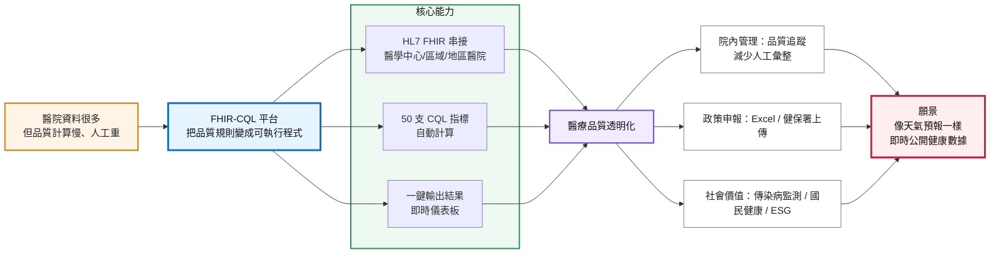
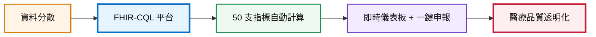

# 🏆 得獎應用程式展區 — 準備資料

> 展覽日期：2026/4/13（日）下午 1:30「50 項得獎應用程式展區介紹」

---

## 1. 口頭 1 分鐘程式介紹

### 🇹🇼 中文版（約 60 秒）

> 1854 年倫敦霍亂大爆發，所有人都認為是空氣傳染。一位醫生把每個死亡案例標在地圖上，發現全部圍繞同一個水井。關掉水井，疫情結束。**數據，救了一座城市。**
>
> 170 年後的今天，台灣醫院每天產生數以萬計的電子病歷，但這些數據還沒有被串在一起。我們的 APP「FHIR-CQL 醫療品質自動量測平台」，就是要做這件事。
>
> 平台採用國際 HL7 FHIR 標準與 CQL 臨床品質語言，將醫療品質指標轉化為可自動執行的程式邏輯。**目前已成功運行 50 支 CQL 指標。**醫院連上 FHIR Server，一鍵就能計算品質指標、傳染病監測、國民健康、ESG，並支援模組化擴充。
>
> 而且，這些數據也能即時公開給民眾——就像天氣預報一樣，**讓健康數據變得可預測、可行動。**
>
> 謝謝大家。

---

### 🇺🇸 English Version (~60 seconds)

> In 1854, cholera hit London hard. Everyone thought it spread through the air. One doctor marked every death on a map and found they all pointed to one water pump. He shut it down — and the outbreak stopped. **Data saved a whole city.**
>
> 170 years later, hospitals in Taiwan create thousands of medical records every day — but this data is still separate and not linked together. Our app, the **FHIR-CQL Medical Quality Platform**, is here to fix that.
>
> We use the global **HL7 FHIR standard** and **CQL — Clinical Quality Language** to turn quality rules into code that runs by itself. **50 CQL modules are already working.** With one click, hospitals get quality scores, disease tracking, public health numbers, and ESG reports — and it's easy to add more.
>
> Best of all, this data can go public in real time — **like a weather forecast, but for health.**
>
> Thank you.

---

## 2. 攤位文字簡介（200 字）

> **FHIR-CQL 醫療品質自動量測平台**
>
> 本平台基於國際 HL7 FHIR 電子病歷標準與 CQL 臨床品質語言，涵蓋用藥安全、門診品質、住院照護、手術感染、藥品重疊偵測等面向，全數轉化為可自動執行的計算邏輯。醫院連線 FHIR Server 後，一鍵即可完成品質指標計算，結果透過互動儀表板即時呈現，並將支援 Excel 報表匯出與健保署線上申報。平台取代傳統人工抽審與 Excel 彙整流程，大幅提升醫療品質監測效率與正確性，協助全台醫院邁向數據驅動的智慧品質管理。

---

## 4. 程式解說圖片（PITCH 版本）

> 下方是適合展場簡報的一頁式 Mermaid 圖，重點是「痛點 → 解法 → 成果」。
> 建議用 https://mermaid.live 貼上後匯出 PNG/SVG。



### 10 秒版（評審一眼看懂）



建議匯出檔名：`程式解說圖_10秒版.png`

### 匯出圖片步驟

1. 複製上方 Mermaid 程式碼（不含 ` ```mermaid ` 標記）
2. 前往 [mermaid.live](https://mermaid.live)
3. 貼上 → 右側即時預覽
4. 點選 **Actions → Export PNG**（建議寬度 1920px）
5. 儲存為 `程式解說圖_PITCH版.png` 繳交

---

## 準備進度

| 項目 | 狀態 |
|------|------|
| 1. 口頭 1 分鐘中/英文介紹稿 | ✅ 完成 |
| 2. 攤位文字簡介 200 字 | ✅ 完成 |
| 3. 程式 Logo 圖 | ⏳ 待提供 |
| 4. 程式解說圖片 | ✅ 完成（Mermaid PITCH 版） |
